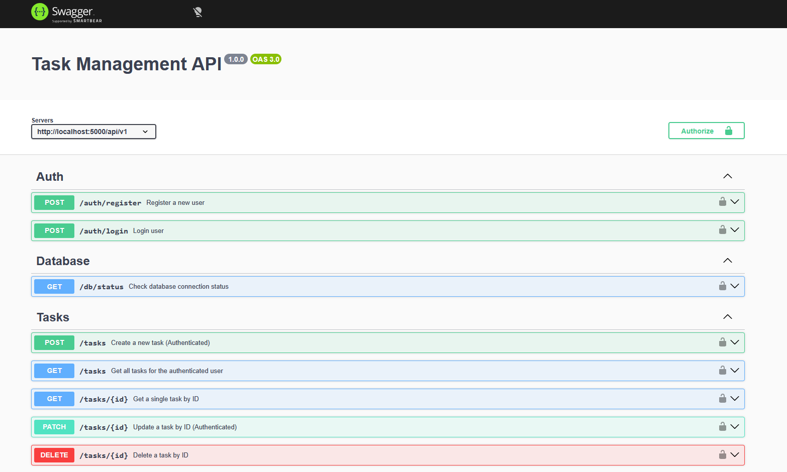

# 🚀 Production-Ready Backend API (Node.js + Express + PostgreSQL)

A scalable backend system demonstrating real-world backend engineering practices — authentication, task management, testing, CI/CD, and production-grade architecture.

---

## 🟢 Live Status


---

## 🌍 Live Demo

- 🔗 API Base URL: https://production-ready-nodejs-api-p9t1.onrender.com
- 📘 Swagger Docs: https://production-ready-nodejs-api-p9t1.onrender.com/api-docs
---

## ❗ What Problem This Solves

Most backend tutorials stop at basic CRUD.

This project solves **Real production challenges:**

- 🔐 Secure user authentication & authorization
- 📊 Managing user-specific data (multi-user isolation)
- ⚡ Efficient querying (pagination, filtering, search)
- 🧱 Scalable architecture for growing applications
- 🚀 CI/CD automation for reliable deployments
- 🛡️ Security best practices (rate limit, headers, validation)

👉 Built to reflect how real SaaS backend systems work

---

## ⚡ Features (Quick Scan)

- 🔐 JWT authentication & protected routes
- 🔑 Password hashing (bcrypt)
- 📊 Task CRUD with ownership validation
- 🔎 Pagination, filtering, sorting, search
- 🛡️ Helmet + Rate limiting
- 📄 Swagger API documentation
- 🧪 Test-ready structure (Jest)
- 🚀 CI/CD with GitHub Actions
- 📦 Clean layered architecture
---

## 🧱 Architecture

```
Client
  ↓
Routes
  ↓
Controllers
  ↓
Services
  ↓
Prisma ORM
  ↓
PostgreSQL
```
```
✔ Separation of concerns
✔ Scalable & maintainable
✔ Production-ready design
```
---

## 📂 Project Structure

```
src/
├── config/          # Environment & app config
├── controllers/     # Request handlers
├── middlewares/     # Auth, error, validation middleware
├── routes/          # API routes
├── services/        # Business logic
├── validators/      # Request validation logic
├── utils/           # Helpers & utilities
│
tests/               # Test files

```
---

## 🔗 API Endpoints
## 🔐 Auth
```
| Method | Endpoint              | Description   |
| ------ | --------------------- | ------------- |
| POST   | /api/v1/auth/register | Register user |
| POST   | /api/v1/auth/login    | Login user    |
```


### 👤 User

```
| Method | Endpoint         | Description             |
| ------ | ---------------- | ----------------------- |
| GET    | /api/v1/users/me | Get profile (Protected) |

```


### 📊 Tasks
```
| Method | Endpoint          | Description     |
| ------ | ----------------- | --------------- |
| POST   | /api/v1/tasks     | Create task     |
| GET    | /api/v1/tasks     | Get all tasks   |
| GET    | /api/v1/tasks/:id | Get single task |
| PUT    | /api/v1/tasks/:id | Update task     |
| DELETE | /api/v1/tasks/:id | Delete task     |

```
---

## 📸 Screenshots

### 📘 Swagger API Docs



---
## 🛠 Tech Stack

```
| Layer    | Technology            |
| -------- | --------------------- |
| Backend  | Node.js, Express      |
| Database | PostgreSQL            |
| ORM      | Prisma                |
| Auth     | JWT                   |
| Testing  | Jest                  |
| DevOps   | GitHub Actions        |
| Security | Helmet, Rate Limiting |
| Logging  | Morgan                |

```
---

## Deployment

This project is deployed on **Render** with a PostgreSQL database.

- Backend: Render Web Service  
- Database: PostgreSQL (Render/Neon)  
- ORM: Prisma  

Deployment includes:
- environment-based configuration  
- production-ready server setup  
- Prisma migrations during build  

## ⚙️ Getting Started

### 1. Clone Repo
```bash
- git clone https://github.com/ashrafakib02/production-ready-nodejs-api
- cd production-ready-nodejs-api
```

### 2. Install Dependencies
```bash
- npm install
```

### 3. Setup Environment Variables
```bash
DATABASE_URL=your_postgres_url
JWT_SECRET=your_secret
PORT=5000
```

### 4. Run Migration
```bash
- npx prisma migrate dev
```

### 5. Start Server
```bash
- npm run dev
```

---
### 🧪 Scripts

```bash
- npm run dev     # Development
- npm start       # Production
- npm run lint    # Lint
- npm test        # Tests
```

---

## 📦 Example Request
```
POST /api/v1/auth/register
```
```
{
  "name": "John Doe",
  "email": "john@example.com",
  "password": "123456"
}
```
---

## ⚠️ Error Response Format
```
{
  "status": "error",
  "message": "User already exists",
  "data": null
}
```

---
## 🧠 Production Considerations
This project includes real-world backend concerns:

- 🔐 Authentication & authorization layers
- ⚡ Query optimization (pagination, filters)
- 🛡️ Security (Helmet, rate limiting)
- 🧱 Modular architecture (scalable codebase)
- 🚀 CI/CD pipeline (automated checks)
- 🌍 Environment-based deployment
- 🧪 Test-ready structure

👉 Designed to scale from small app → production system

---
## 📈 What This Project Demonstrates

- Production-level backend architecture
- Secure authentication system
- REST API best practices
- Database management with Prisma
- CI/CD workflow integration
- Clean, maintainable code

---

## 👨‍💻 Author
**Ashraful Islam**
Backend Engineer

- 🌍 Open to Remote Opportunities
- 💼 Focused on scalable backend systems

---

## ⭐ Final Thought
This is not just a CRUD project.

It reflects **how real backend systems are designed, secured, and deployed in production.**

---
